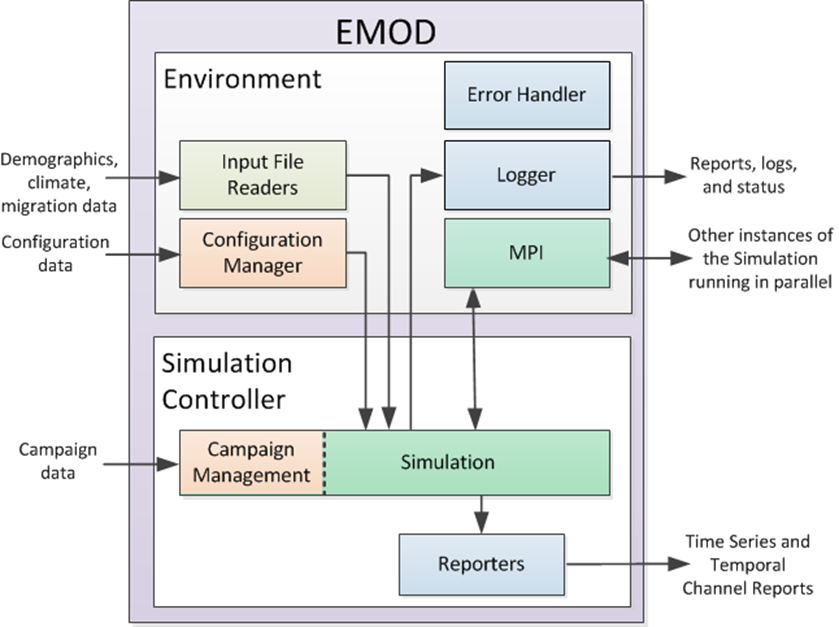

# Overview

EMOD is implemented in C++ and has two subsystems: the environment and the simulation controller.
The environment contains the interfaces to the simulation controller subsystem and the external
inputs and outputs. The simulation controller contains the epidemiological model (simulation and
campaign management), and reporters that capture output data and create reports from a simulation.
The following figure shows a high-level view of the system components of EMOD and how they are
related to each other.

!!! warning
    If you modify the source code to add or remove configuration or campaign parameters, you may
    need to update the code used to produce the schema. You must also verify that your simulations
    are still scientifically valid.
